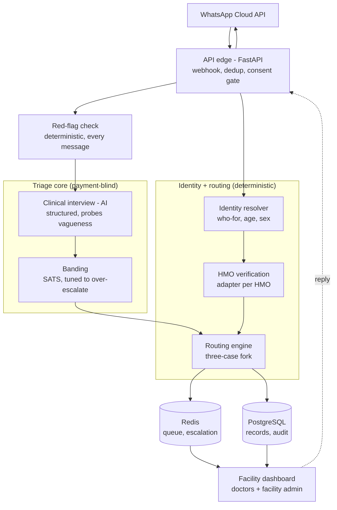
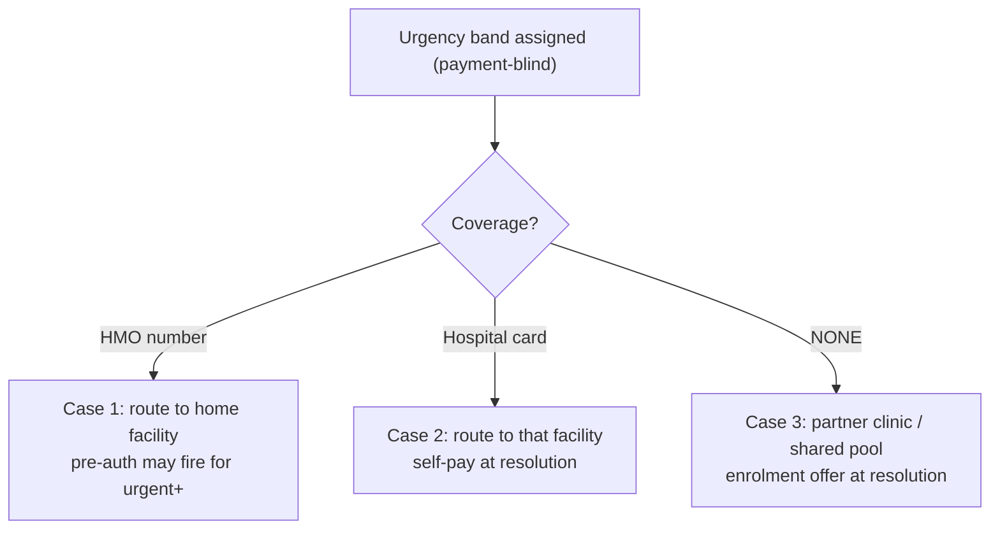
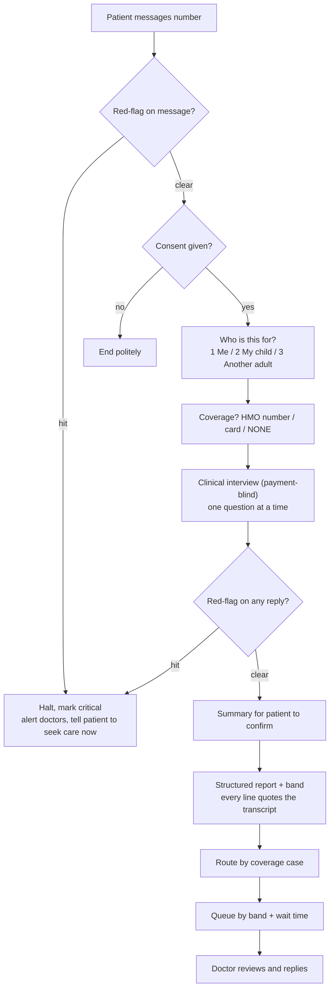
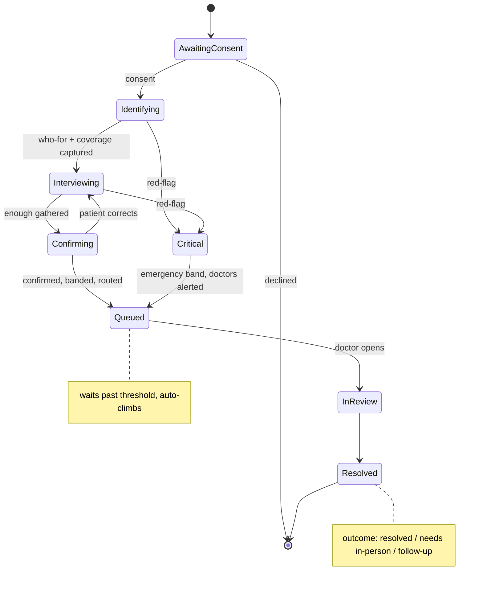
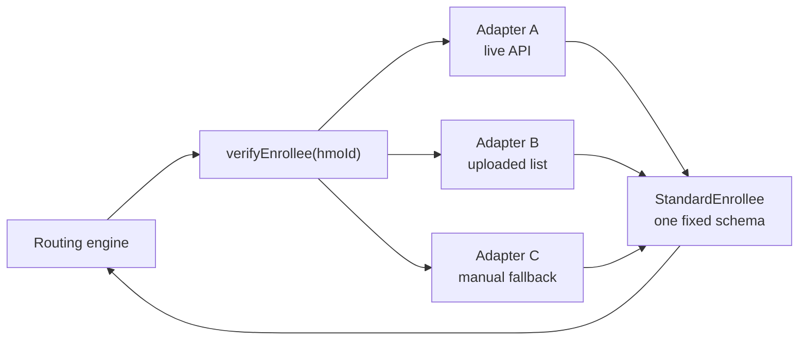
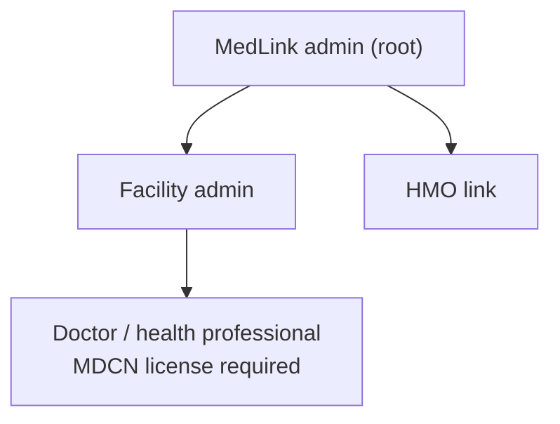
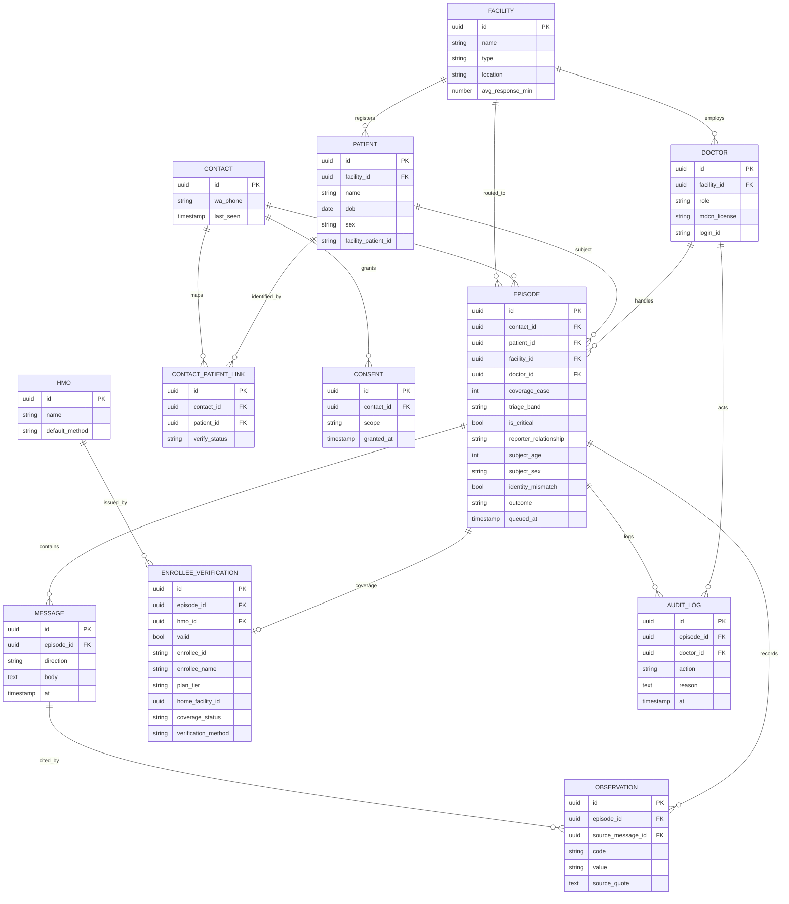

# MedLink AI — Backend Technical Specification

| | |
|---|---|
| Product | MedLink AI — triage and intake layer between patients and doctors |
| Status | MVP build |
| Jurisdiction | Nigeria (NDPA applies) |
| Patient channel | WhatsApp (Meta Cloud API); patients never install an app or hold an account |
| Staff interface | Facility web dashboard (separate spec) |
| Audience | Backend engineer(s) starting implementation |

> This spec was reconciled against the MedLink AI product document. Where the product document narrowed MVP scope (text-only, English-only, no prescriptions/tests/media), those items moved to the Roadmap (Section 22). See the changelog at the end of this file.

---

## 1. Overview

MedLink AI sits between patients and doctors. A patient describes symptoms over WhatsApp; an AI runs a structured clinical interview inside that chat and produces a clean, structured report with an urgency band. Doctors receive reports on a web dashboard sorted by urgency (not arrival time), review, and reply — the reply is delivered into the same WhatsApp thread.

The AI does not diagnose. It gathers, structures, and prioritises. Every clinical decision is made by a licensed human doctor.

Beyond triage, MedLink connects to how care is paid for and delivered in Nigeria: it resolves who a patient is and who covers them, and routes each case to the right facility. Patients arrive in three coverage states (HMO, hospital card, or nothing), and MedLink handles all three.

---

## 2. The one principle everything hangs on

**Triage and payment are two separate questions, and the triage core is payment-blind.**

- Triage asks: how urgent is this, and what should happen next?
- Payment and routing ask: who is this patient, who pays, which facility?

How someone pays never influences how urgent they are. Identity, verification, and routing happen in deterministic code *around* the triage core — never inside it. The clinical interview never sees insurance status. This is an architectural boundary, not a guideline: coverage data must not be reachable from the interview or banding code paths.

---

## 3. Scope and assumptions

MVP in scope:

- WhatsApp text intake in English, zero patient-side software or accounts.
- Consent-first flow (NDPA), then two routing questions (who-for, coverage), then a payment-blind clinical interview.
- Deterministic red-flag layer on every inbound message; four-band triage mapped to an established protocol.
- Three-case coverage routing; HMO verification via an adapter pattern.
- Facility and staff accounts (facility admin, doctor); MedLink admin (us) at the root.
- Doctor reply relayed to WhatsApp; case outcome recorded.
- Immutable, timestamped audit trail with source traceability.

MVP out of scope (Roadmap, Section 22): local languages; voice/image/video media; test orders, lab-result upload, and prescriptions; payments/billing/scheduling; dependent-lookup for shared-phone eligibility; on-device offline red-flag checking.

Assumptions:

- Clinical objects are shaped loosely after FHIR resources (Patient, Encounter, Observation) for later interoperability without full FHIR overhead.
- Every account above the patient is created by someone with authority over them; no anonymous doctor reaches the platform (MDCN license captured).

---

## 4. Design principles (the safety spine)

1. **Payment-blind triage** (Section 2). Coverage data is unreachable from interview/banding.
2. **Deterministic red-flags before the AI.** A clinician-written list in plain code, checked on every inbound message before any model call, tuned to over-escalate.
3. **Privilege separation.** The patient-facing AI has no consequential capabilities; it only proposes structured JSON that the system schema-validates and persists. A jailbroken bot can at worst produce a rejected blob.
4. **All input is untrusted data.** Patient text (and, on the roadmap, transcripts/OCR) never enters an instruction position; it flows into typed fields a doctor verifies.
5. **The episode is the unit of care.** A WhatsApp thread is a series of episodes, each a small state machine. Every inbound message resolves to an episode first.
6. **Source traceability.** Every line of the structured report links to the patient's own words, quoted from the transcript, so a doctor verifies rather than re-interviews — and so clinical disputes are defensible.
7. **Doctor owns every clinical decision.** The dashboard is the only place real-world actions happen, each audited.

Reference frames: OWASP LLM Top 10 (LLM01), least-privilege / dual-LLM pattern, South African Triage Scale (SATS) for banding.

---

## 5. View 1 — System architecture

The triage core is walled off from identity and routing. Note that no edge runs from the identity/routing lane into the triage core.



---

## 6. The three coverage cases

Every patient is triaged identically. Only after a band exists does routing fork by coverage.

| Case | Patient has | Routes to | Payment | MedLink role |
|---|---|---|---|---|
| 1 | An HMO plan | Registered primary (home) facility | HMO covers; pre-auth can start early | Triage + coverage routing |
| 2 | A hospital card only | That facility's doctors | Self-pay, known at resolution | Triage + intake |
| 3 | Nothing | Partner clinic / shared doctor pool | Self-pay or enrolment offer | Triage + onboarding funnel |

For Case 1 urgent/emergency bands, a pre-authorisation signal can fire to the HMO in parallel so the auth process starts before the patient arrives. Case 3 is the acquisition funnel: every resolution is a chance to enrol an uninsured patient, feeding Cases 1 and 2 over time.



---

## 7. View 2 — Patient / intake flow



Consent is the system's first reply and gates all clinical questions. The deterministic red-flag check runs on every inbound message, including the first, before consent and before the AI — a genuine emergency ("my baby isn't breathing") halts immediately regardless of where the patient is in the flow.

---

## 8. Identity resolution — three identities

One phone is often shared across a family. A naive design that assumes the sender is the patient corrupts both triage and identity.

| Identity | What it is | What it drives |
|---|---|---|
| Phone owner | The WhatsApp account | Nothing clinical on its own |
| Sender | The person typing | May be a proxy reporter |
| Patient | Whoever is actually sick | The clinical report and triage |

Resolution rules:

- **Who-for menu** right after consent: 1 Me / 2 My child / 3 Another adult. Three options only.
- **Capture the patient's own age and sex.** Age flips red flags — fever in a newborn under two months is an emergency; the same fever in an adult is routine. Without the subject's real age, the red-flag layer checks the wrong ruleset.
- **Third-person interview for a proxy** ("Can she stand on her own?"), treating answers as secondhand and accepting "I don't know" while noting gaps.
- **Decouple identity from the patient.** The enrollee/card number identifies the *account* and drives routing; the triaged patient is resolved separately and drives the report. Where they differ, flag the mismatch to the doctor / HMO rather than assuming the sick person is covered.
- **Re-ask on every new case.** Within one case the patient is fixed; across cases on the same number, who-for is re-established.

MVP boundary: MedLink does not resolve coverage-eligibility for a borrowed phone (is this child a dependent on the plan?). It surfaces the possible mismatch as a note. Dependent-lookup is v1.1, once an HMO supplies dependent data.

---

## 9. Triage banding

Two layers:

- **Layer one — red flags.** A fixed, clinician-written list held in plain code, never in the AI, checked on every inbound message before the AI runs, tuned to over-escalate. A hit halts the interview, marks the episode critical, alerts doctors, and tells the patient to seek in-person care now.
- **Layer two — banding.** All other cases sort into four bands: emergency, urgent, routine, non-urgent — mapped to an established protocol (South African Triage Scale) rather than an invented score.

Rules: when uncertain, escalate upward, never downward. Cases waiting beyond a threshold climb the queue automatically. A doctor can override any band; every override is logged with doctor ID and reason.

---

## 10. View 3 — Episode lifecycle (MVP)



Resolving the episode first is what keeps unrelated complaints from contaminating each other's context; a new complaint opens a fresh episode. The test/results/prescription loop from the earlier draft is Roadmap (Section 22) — MVP resolution is a reply plus an outcome.

---

## 11. HMO verification — adapter pattern

Every Nigerian HMO exposes data differently, or not at all. Application code must never care. It speaks to one internal interface — `verifyEnrollee(hmoId)` returns a `StandardEnrollee` — behind which sits one adapter per HMO. Signing a new HMO means writing one new adapter; nothing else changes.



MVP HMO detection is a patient pick-list (ID formats collide across HMOs). Verification methods: live API (a minority of larger HMOs), uploaded enrollee list (the MVP default), manual fallback (facility confirms on arrival).

The `StandardEnrollee` contract — every adapter populates exactly these fields, returning `unknown` rather than omitting any:

```json
{
  "valid": true,
  "enrolleeId": "string",
  "patientName": "string (the enrollee / account holder)",
  "hmoName": "string",
  "planTier": "string | unknown",
  "homeFacilityId": "uuid (drives routing)",
  "coverageStatus": "active | lapsed | unknown",
  "verificationMethod": "api | list | manual"
}
```

Two rules: the verification result feeds routing, never triage; `patientName` is the enrollee's name, which on a shared phone may differ from who is sick — this object identifies the account, the triaged patient is resolved separately (Section 8), and mismatches are flagged.

---

## 12. Access model — who logs in

Facilities and their staff have accounts and log in. Patients never do. Every account above the patient is created by someone with authority over them.



| Role | Created by | Can do | Cannot do |
|---|---|---|---|
| MedLink admin (us) | Root | Onboard facilities and HMOs; suspend any facility, doctor, or HMO link | — |
| Facility admin | MedLink admin | Create/manage own doctors; see facility queue and aggregate stats | Touch another facility's data |
| Doctor / health pro | Facility admin | Log in, see only own facility's queue, review cases, reply | Self-register; see other facilities |
| Patient | No account | Use WhatsApp; identified by phone + enrollee/card number | Log in anywhere |

Facility onboarding (four steps): MedLink admin verifies the facility and creates its facility-admin account (the only account we create by hand) → facility admin completes the profile and uploads the patient/enrollee list → facility admin enrols each doctor with name, role, and MDCN license → facility goes live. The doctor's first login forces a password reset and re-consent, so the facility admin never permanently holds a doctor's password.

Permission boundary to build: keep admin (managing accounts) and clinical (reading cases) as separate permissions even when one person holds both. A facility admin sees aggregate stats but must not read arbitrary patient clinical reports unless acting as the treating clinician on that case. This is what an HMO's compliance team and the NDPA will ask about.

---

## 13. View 4 — Data model (ERD)



Points to note:

- `FACILITY.type` is `hospital` or `clinic`. Clinics supply doctors to the shared pool for Case 3.
- `CONTACT` (phone / account) and `PATIENT` (facility-registered clinical identity) are distinct; one contact maps to many patients. Case 3 patients may have no `PATIENT` row — the episode carries `subject_age`, `subject_sex`, and `reporter_relationship` directly, which is what drives age-based red flags.
- `triage_band` replaces the earlier free `severity_rank` and holds the SATS band; `is_critical` marks a red-flag halt.
- `OBSERVATION.source_quote` + `source_message_id` implement source traceability — the dispute defence.
- `ENROLLEE_VERIFICATION` is the persisted `StandardEnrollee`; `home_facility_id` drives routing and is never read by the triage core.
- `AUDIT_LOG` is immutable and append-only; `reason` captures override justifications.

---

## 14. Component responsibilities

**API edge (FastAPI).** Verifies webhook signatures, deduplicates by message ID, enforces the consent gate, and drives the who-for and coverage questions. Sends outbound WhatsApp messages. Stateless, horizontally scalable.

**Red-flag check.** Deterministic phrase/keyword sets keyed off message text plus subject age band. Runs before any model call. A hit escalates immediately and still queues the case.

**Triage core (payment-blind).** The AI clinical interview (structured output, one question at a time, probes vagueness) and the SATS banding. Receives no coverage data.

**Identity resolver, HMO verification, routing engine (deterministic).** Resolve the three identities, call `verifyEnrollee`, and fork to the correct facility/queue by coverage case. Emit mismatch flags.

**Facility dashboard backend.** Auth, queue queries by band and wait time, case assembly with source-traced report and transcript, reply relay, band override, outcome recording, handoff, audit, and facility-admin functions (doctor management, list upload, aggregate stats).

---

## 15. Context and memory

Never replay the raw transcript. Load three layers, all queries against the schema: the canonical record (`PATIENT` plus long-standing observations, always loaded), a short per-episode rolling summary (a column on `EPISODE`, overwritten as intake progresses — keeps token cost flat), and relevant prior closed-episode summaries retrieved only when the current complaint relates to them. Structured, typed fields beat a growing narrative blob because the model does not re-parse prose for safety facts each turn.

---

## 16. WhatsApp integration

Meta Cloud API directly (no BSP). The dev dashboard provides an immediate test number for up to 5 pre-registered recipients with no business verification — the same path used in production. Webhook verification (GET challenge) and inbound webhook (POST); deduplicate by message ID. The 24-hour customer-service window means proactive re-engagement (wait-time nudges) outside 24h requires a pre-approved template message — submit templates for approval early, it is the only item with lead time.

---

## 17. No-response safety net

The model assumes doctors are on the dashboard. For each lane, define who responds, in what window, and what happens when no one does. An emergency-banded case unanswered beyond a threshold auto-climbs the queue and escalates to a fallback (a supervising doctor, or telling the patient to go in person). A triage system that flags an emergency and then goes silent is a liability, not a feature. Implement escalation as a scheduled worker over `queued_at` and `triage_band`.

---

## 18. Disputes and audit

Three dispute types, all resolved by the immutable, timestamped audit trail:

| Type | Looks like | Resolved by |
|---|---|---|
| Clinical | "Triage was wrong" | Transcript + every report line traced to the patient's own words; the AI only gathered, a licensed human decided |
| Coverage | "The HMO won't pay" | Verification method + result recorded, with plan tier and coverage status at time of contact |
| Identity | Wrong patient / shared phone / shared enrollee abuse | Who-for answer, subject attributes, and enrollee number stored separately, with mismatch flags |

The audit log holds, immutable and timestamped: every band assignment and red flag, every doctor action, every override with doctor ID and reason, and consent plus the who-for answer for every case.

---

## 19. Non-functional requirements

Scale target ~500 patients/day, ~100 concurrent conversations — comfortable for a single FastAPI service with Redis and Postgres; scale workers horizontally later. Security/PHI: per-doctor auth, facility-scoped queries that never leak other facilities' data, admin/clinical permission separation, consent captured once per contact, full audit, no PHI in URL query strings. Idempotency: dedup inbound webhooks by message ID. Observability: structured logs, per-episode trace, alerts on guard-layer and escalation-worker errors.

---

## 20. Tech stack

Python, FastAPI, PostgreSQL, Redis, an AI provider for the interview and (soft) guard model, Pydantic for validation everywhere AI output touches the system, Alembic for migrations. The HMO adapter layer is plain Python behind a single interface.

---

## 21. Build order (milestones)

1. DB migrations for the schema in Section 13.
2. WhatsApp webhook + consent gate + who-for + coverage capture (contact/patient resolution, dedup).
3. Deterministic red-flag layer (age-aware), before any model call.
4. Triage core: payment-blind clinical interview (structured output) + SATS banding, with source-quoted report lines.
5. Identity resolver + HMO adapter interface (start with uploaded-list and manual adapters) + routing engine (three cases).
6. Facility dashboard endpoints: auth/first-login reset, queue, case detail + transcript, reply relay, band override, outcome, handoff, audit.
7. No-response escalation worker.
8. Facility-admin functions: doctor management, list upload, aggregate stats.

---

## 22. Roadmap (deferred from MVP)

Explicitly not in MVP per the product document; several were in the earlier draft of this spec and are preserved here:

- Local languages (Pidgin, Hausa, Yoruba, Igbo) and AI plain-language rewrite of doctor replies.
- Voice notes, images, and video understanding (multimodal intake).
- Test orders, lab-result upload with assistive AI extraction, and structured e-prescriptions (with PDF delivery). No drug names over text in MVP; the doctor directs to a facility or pharmacy.
- Payments, billing, and scheduling.
- Dependent-lookup for coverage eligibility on shared phones (v1.1, needs HMO dependent data).
- On-device / USSD red-flag checking to restore offline safety.
- Outcome follow-up loop, doctor-to-doctor second opinions, health-worker vitals entry.

---

## 23. Open questions / validate before building

- HMO incentive: the assumption that HMOs pay to reduce visits is plausible but unproven; validate with one real HMO before building the coverage layer around it.
- Regulatory classification of triage as Software as a Medical Device; clinical-liability owner; remote-care scope limits over text.
- Per-facility empirical response-time baselines (currently a static `avg_response_min`).

---

## Changelog vs previous draft

- Renamed to MedLink AI; added the payment-blind principle as the governing constraint.
- Added the three-case coverage model and routing engine.
- Generalised hospital to facility (hospital or clinic); added the MedLink-admin / facility-admin / doctor hierarchy, MDCN capture, forced first-login reset, and admin/clinical permission separation.
- Added HMO verification via the adapter pattern and the `StandardEnrollee` contract; replaced `INSURANCE_POLICY` with `ENROLLEE_VERIFICATION` + `HMO`.
- Replaced free `severity_rank` with SATS `triage_band` + `is_critical`; added waiting-time auto-climb and the no-response safety net.
- Added consent-first flow, the three-identity model (who-for, subject age/sex, proxy interview, mismatch flags), and source traceability on observations.
- Added the disputes framework and expanded the audit log.
- Moved multimodal, test/result/prescription loop, multi-language, and AI reply-rewrite to the Roadmap to match MVP scope.
