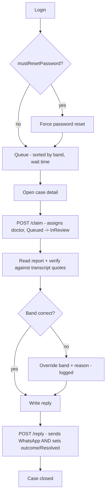
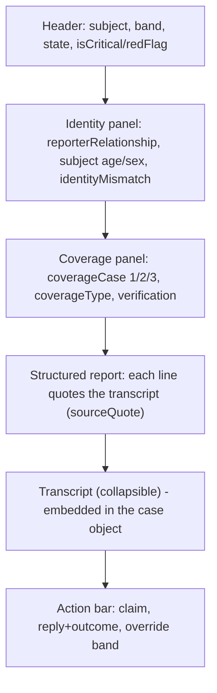

# MedLink AI — Frontend Technical Specification

| | |
|---|---|
| Product | MedLink AI |
| Status | MVP build |
| Surface | Facility web dashboard (hospitals and clinics) |
| Patients | No frontend — patients interact entirely via WhatsApp, no account |
| Consumes | Backend REST API (Node/Express implementation in this repo) |
| Audience | Frontend engineer(s) starting implementation |

> **Reconciled to the running backend (2026-07).** The original draft was written against a Python/FastAPI backend (`:8000`, `/docs`, `/episodes`, snake_case, `login_id`). The backend was ported to **Node/Express**, so this document has been rewritten to the contract the server actually serves: `/api/*` routes, **camelCase** JSON, email-based login, and `{error, message}` errors. A live **Swagger UI is served at `/docs`** and the raw spec at **`/openapi.json`** (with request/response examples). See the "Deviations from the original spec" box in §12 for the load-bearing differences.

---

## 1. Overview

The only human-facing UI in MedLink is the facility dashboard used by facility staff. Patients never touch a screen we build — they message a WhatsApp number and an AI runs intake. This spec covers the dashboard: how staff log in, how a facility admin manages doctors and lists, and how a doctor works a queue sorted by urgency, reads a source-traced report, replies, and records an outcome.

Two things drive the whole UI: **urgency is the primary sort** (not arrival), and **every clinical action is audited**. The interface must make case state obvious and make irreversible actions (send reply, override a band) deliberate.

---

## 2. Users and roles

| Role (`role` value) | Sees | Key rule |
|---|---|---|
| `facility_admin` | Own facility only: doctor management, facility profile, enrollee list upload, aggregate stats | Must not read arbitrary clinical reports unless acting as the treating clinician |
| `doctor` | Own facility's queue and cases | MDCN-verified; scoped to one facility |
| `medlink_admin` (us) | All facilities; onboards facilities. Mostly internal tooling, out of scope for the dashboard | Root; created via bootstrap only |

Admin (managing accounts) and clinical (reading cases) are separate permissions even when one person holds both. The backend enforces this (`GET /api/cases/:id` returns `403` for a `facility_admin` who isn't the treating clinician); the UI must mirror it and not expose clinical views in the admin area.

---

## 3. Screens

**Login.** Email + password. A doctor's first login forces a password reset before any case is visible (see §12.5).

**Facility admin area.** Facility profile (name, type hospital/clinic, location); enrollee list upload (so Case 1/Case 2 patients can be matched); doctor management (add a doctor with name, email, MDCN license); aggregate stats (volume, band mix, state mix). No access to individual clinical reports from here.

**Queue (doctor).** Cases for the doctor's facility, sorted by band then wait time. Critical / emergency cases sort to the top and must be visually distinct. Each row shows subject (with proxy indicator when reported by someone else), chief complaint, band, wait time (derived client-side from `queuedAt`/`createdAt`), coverage-case badge (1/2/3), and flags (identity mismatch, critical, red flag). Cases that have auto-climbed show why (from the audit trail).

**Case detail (doctor).** The core screen — see §5.

**Reply + outcome.** A reply box; on send, the reply lands in the patient's WhatsApp thread **and resolves the case with the chosen outcome in one call** (`resolved` / `needs_visit` / `follow_up`). This is a single deliberate action in this backend — see the deviation note in §12.

**Band override.** Inline control to change the triage band; requires a reason and is logged with the doctor's ID.

**Audit trail.** Per-case timeline: band assignments, red flags, doctor actions, overrides with reasons, consent, and the who-for answer. Delivered **embedded in the case object** (`auditTrail[]`), not a separate endpoint.

---

## 4. Doctor workflow



Note: unlike the original draft, **reply and resolve are a single call** (`POST /api/cases/:id/reply` takes both `responseMessage` and `outcome`). "Opening" a case is an explicit `POST /api/cases/:id/claim` (moves `Queued → InReview`).

---

## 5. Case detail — screen anatomy



Design rules:

- **Source traceability is the point of this screen.** Every `report[]` line carries `sourceQuote` (the patient's own words) and `sourceMessageId`. Render the quote inline; clicking a line should reveal that turn in the embedded `transcript[]`. Doctors verify, they do not re-interview.
- **Band is decision-support, overridable.** The override control is inline and always requires a reason.
- **Coverage never colours urgency.** The coverage panel is informational and visually separate from the band; never imply an uninsured patient (`coverageCase: 3`) is lower priority.
- **Identity mismatch is explicit.** When `subject.identityMismatch` is true, show the flag rather than assuming coverage applies.
- **Irreversible controls confirm.** Send reply (which also resolves) and override each take a confirm step.

---

## 6. Data the frontend consumes

Both the queue and case-detail endpoints return the **same assembled case object** (the queue returns an array of them; there is no separate compact row shape in this backend). Exact shape:

```json
{
  "id": "uuid",
  "state": "InReview",
  "patientPhone": "whatsapp:+234...",
  "subject": {
    "reporterRelationship": "self",
    "age": 35,
    "sex": "male",
    "identityMismatch": false
  },
  "primaryComplaint": "stomach cramps",
  "triageBand": "urgent",
  "isCritical": false,
  "redFlagTriggered": "",
  "coverage": {
    "coverageCase": 3,
    "coverageType": "none",
    "verification": null
  },
  "facilityId": "uuid",
  "doctorId": "uuid-or-null",
  "outcome": null,
  "queuedAt": "2026-07-22T20:39:00.000Z",
  "report": [
    {
      "code": "duration",
      "value": "approximately 2 days, intermittent",
      "sourceQuote": "it started about 2 days ago and comes and goes",
      "sourceMessageId": "uuid"
    }
  ],
  "transcript": [
    { "direction": "inbound",  "body": "Hello", "at": "2026-07-22T20:35:00.000Z" },
    { "direction": "outbound", "body": "Welcome to MedLink...", "at": "2026-07-22T20:35:01.000Z" }
  ],
  "auditTrail": [
    { "action": "band_assigned", "reason": "SATS urgent discriminator: \"cramp\"", "doctorId": null, "at": "..." },
    { "action": "auto_climb", "reason": "Waited 30m in 'urgent'; auto-climbed to 'emergency'", "doctorId": null, "at": "..." }
  ],
  "createdAt": "...",
  "updatedAt": "..."
}
```

Any field can be `null`/empty where not yet known. There is **no** `wait_minutes`, `auto_climbed`, `flags[]`, `subject_label`, `rolling_summary`, or `red_flag_reason` on the wire — derive what you need:

| Frontend concept | Derive from |
|---|---|
| wait time | `now - (queuedAt || createdAt)` |
| "auto-climbed" badge + why | an `auditTrail[]` entry with `action: "auto_climb"` |
| critical pin | `isCritical === true` or `state === "Critical"` |
| red-flag reason | `redFlagTriggered` (non-empty string) |
| identity-mismatch flag | `subject.identityMismatch === true` |
| unverified coverage | `coverage.verification === null` (or its `status` when present) |
| proxy indicator | `subject.reporterRelationship !== "self"` |
| subject label | compose from `subject.age` + `subject.sex` (+ proxy); patient identity is a phone number, no name |

---

## 7. Endpoints used (dashboard)

All under base `/api`. All dashboard endpoints require auth (Bearer header or `auth_token` cookie).

```
POST  /api/auth/login                       # { email, password }
POST  /api/auth/first-login-reset           # { email, currentPassword, newPassword }
GET   /api/auth/me                          # current doctor
POST  /api/auth/logout

GET   /api/cases?status=&urgency=           # queue (facility-scoped from token)
GET   /api/cases/:id                         # case detail (report + transcript + audit embedded)
POST  /api/cases/:id/claim                   # open/assign: Queued -> InReview
POST  /api/cases/:id/override                # { urgencyBand, reason }  (band override)
POST  /api/cases/:id/reply                   # { responseMessage, outcome } -> WhatsApp + Resolved

# facility admin
POST  /api/facilities                        # medlink_admin: create facility + its admin
POST  /api/facilities/:facilityId/doctors    # add doctor
GET   /api/facilities/:facilityId/doctors
POST  /api/facilities/:facilityId/enrollees  # JSON enrollee list (not CSV)
GET   /api/facilities/:facilityId/stats
# facility_admin may also call the same four without :facilityId (uses token's facility)
```

**Not implemented in this backend** (originally specced; treat as roadmap): a separate `resolve` endpoint (folded into `reply`), `handoff` (reassign doctor), doctor `suspend`, a standalone `transcript` endpoint (embedded instead), a standalone `audit` endpoint (embedded instead), and CSV `multipart` enrollee upload (JSON instead).

---

## 8. UX and product rules

- **Urgency-first, coverage-neutral.** The queue sorts by band then wait time; the coverage badge never reorders or de-prioritises a case.
- **Approval is deliberate** for send-reply (which resolves) and override.
- **Verify against the source.** Report lines are always shown with their `sourceQuote`; nothing is presented as fact the doctor hasn't been able to check.
- **Auto-climb is visible** (from `auditTrail`) so doctors understand why a case rose.
- **Escalation visibility.** An emergency case unanswered past threshold auto-climbs server-side; reflect the changed band/`auditTrail` in the queue.
- **Permission separation in the UI.** The facility-admin area exposes no clinical-report views.
- **English, desktop, sentence-case labels, no colour-only status** (pair band colour with a text label; accessibility).

---

## 9. Non-functional

Desktop web for staff at a workstation; responsive is nice-to-have. Token-based, facility-scoped auth; queue and case queries never leak another facility's data (server returns `403`). **Refresh case state on focus or poll the queue**, since state changes server-side (auto-climb, escalation) while the doctor is elsewhere. **Do not store the token in `localStorage`/`sessionStorage`** (PHI rule) — keep it in memory; the backend also sets an httpOnly `auth_token` cookie on login/reset which the browser sends automatically.

---

## 10. Suggested stack

React with a component library of your choice. Keep the case-detail panels (header, identity, coverage, report, transcript, action bar) as independent components mapping to the §6 shape. Centralise API calls and auth-token handling. A ready-made vanilla reference implementation of the whole doctor flow lives at `GET /console` (served by the backend) — useful as a behavioural reference.

---

## 11. Build order (milestones)

1. Auth + routing shell, facility-scoped session, forced first-login reset.
2. Queue view (band + wait-time sort, critical pinned, coverage badge, derived flags).
3. Case detail read-only: source-traced report + collapsible transcript + identity/coverage panels.
4. Claim + reply/outcome, with confirm steps.
5. Band override with reason, and audit-trail view (from the embedded `auditTrail`).
6. Facility-admin area: doctor management, enrollee upload, aggregate stats (clinical views walled off).

---

## 12. API contract (authoritative reference)

> **Deviations from the original (FastAPI) draft — read first:**
> - Base is **`/api/*`** on port **7100** (not `/…` on `:8000`). No `/docs` / `/openapi.json`.
> - JSON is **camelCase**; errors are **`{ "error": "...", "message": "..." }`** (not `{ "detail": ... }`).
> - Login is by **`email`**, not `login_id`. No `accept_terms`/re-consent field.
> - **Reply resolves the case** (send `outcome` with the reply). No separate `resolve`/`handoff`/`suspend`/`transcript`/`audit` endpoints — transcript & audit are embedded in the case object.
> - Queue returns **full case objects**, not compact rows; filter param is **`urgency`**, not `band`; `facility_id` is **not** a query param (it comes from the token).
> - Enums differ: `outcome` uses `needs_visit` (not `needs_in_person`); `reporterRelationship` uses `self` (not `me`).

### 12.1 Base URL, CORS, content type

- Dev base URL: `http://localhost:7100` (`PORT` in `.env`; note `:7000` collides with macOS AirPlay). Remote testing via an ngrok tunnel.
- CORS is fully open in MVP (any origin, credentials allowed).
- Request/response bodies are JSON (`Content-Type: application/json`). The enrollee upload is JSON too (not multipart).

### 12.2 Auth model

- **JWT bearer token.** Send `Authorization: Bearer <token>` on every dashboard endpoint. The backend also accepts the httpOnly **`auth_token` cookie** it sets at login (so same-origin browser calls work without manual header handling). `/api/auth/*`, `/health`, and `/api/twilio/*` need no token.
- **Facility-scoped.** `facilityId`/`role` are derived from the token server-side. `GET /api/cases` and `/api/cases/:id` only return the token facility's data (`medlink_admin` sees all); other facilities' cases `403`.
- **Forced first-login reset.** `POST /api/auth/login` returns `{ mustResetPassword: true, resetToken, doctor }` for a new account. Route the user to the reset screen and call `POST /api/auth/first-login-reset`, which returns a full-access `sessionToken`.
- Token expiry: **24 hours** (a `401` means expired/invalid/logged-out → back to login). Keep the token in memory, not web storage (§9).

### 12.3 Enumerations (switch on these exact strings)

| Concept | Values |
|---|---|
| `triageBand` | `emergency`, `urgent`, `routine`, `non_urgent` (also the sort order, most→least urgent) |
| `state` | `AwaitingConsent`, `Identifying`, `Interviewing`, `Confirming`, `Queued`, `InReview`, `Resolved`, `Critical`, `Declined`, `Abandoned` |
| `coverage.coverageCase` | `1` = HMO, `2` = hospital card, `3` = none/uninsured, `0` if not captured |
| `coverage.coverageType` | `hmo`, `card`, `none`, or `""` |
| `outcome` (reply) | `resolved`, `needs_visit`, `follow_up` |
| `role` | `medlink_admin`, `facility_admin`, `doctor` |
| transcript `direction` | `inbound` (patient), `outbound` (assistant/doctor) |
| `subject.reporterRelationship` | `self`, `child`, `other_adult` |
| `auditTrail[].action` | `consent_granted`, `who_for_captured`, `subject_attributes_captured`, `coverage_captured`, `red_flag_triggered`, `band_assigned`, `band_override`, `routed`, `auto_climb`, `case_opened`, `doctor_reply`, `session_reset`, … |

The queue (`GET /api/cases`) returns cases in `Queued` + `Critical` + `InReview` by default; pass `?status=` to filter to a single state and `?urgency=` to filter to a single band.

### 12.4 Error shape

Non-2xx responses are `{ "error": "<code>", "message": "<human message>" }`; validation errors may add a `details` object. Status codes: `400` (bad input/validation), `401` (missing/invalid/expired/revoked token), `403` (wrong facility, admin-vs-clinical permission, unverified/suspended account, self-registration disabled), `404` (not found), `409` (duplicate), `502` (WhatsApp delivery failed).

### 12.5 Endpoints

**`POST /api/auth/login`** — no auth.
Request: `{ "email": "drkemi@clinic.test", "password": "..." }`
Response `200` (normal): `{ "message": "Login successful", "sessionToken": "...", "doctor": { id, email, fullName, role, facilityId, mdcnLicense, mustResetPassword, isVerified, isActive, ... } }`.
Response `200` (reset required): `{ "message": "...", "mustResetPassword": true, "resetToken": "...", "doctor": {...} }`.
`401` bad credentials; `403` unverified or deactivated. `facilityId` and `role` are inside `doctor`.

**`POST /api/auth/first-login-reset`** — no auth (uses current credentials in body).
Request: `{ "email": "...", "currentPassword": "...", "newPassword": "min 6 chars" }`
Response `200`: `{ "message": "...", "sessionToken": "..." }` (also sets the `auth_token` cookie). `401` on bad current credentials; `400` if the new password is too short.

**`GET /api/auth/me`** — auth. → `{ "doctor": { ... } }`.

**`POST /api/auth/logout`** — auth. Revokes the token; clears the cookie.

**`GET /api/cases?status=&urgency=`** — auth. Queue for the token's facility (`medlink_admin`: all facilities). Both filters optional. → `{ "count": n, "cases": [ <case object §6> ] }`. Sorted by band then longest wait; critical/emergency first.

**`GET /api/cases/:id`** — auth. → `{ "case": <case object §6> }`. `403` if another facility's case, or a `facility_admin` who isn't the treating clinician; `404` if not found.

**`POST /api/cases/:id/claim`** — auth. Assigns the case to the caller and moves `Queued → InReview`. → `{ "message": "...", "caseId": "uuid" }`.

**`POST /api/cases/:id/override`** — auth. Request: `{ "urgencyBand": "emergency", "reason": "non-empty" }`. → `{ "message": "...", "caseId": "uuid", "oldBand": "urgent", "newBand": "emergency" }`. `400` on unknown band or missing reason. Logged to the audit trail with the doctor's ID.

**`POST /api/cases/:id/reply`** — auth. **Sends the reply to the patient's WhatsApp thread and resolves the case.** Request: `{ "responseMessage": "...", "outcome": "resolved" | "needs_visit" | "follow_up" }`. → `{ "message": "...", "case": <updated case object, state = Resolved> }`. `400` on empty message / invalid outcome; `502` if WhatsApp delivery fails.

**`POST /api/facilities`** — `medlink_admin` only. Request: `{ "name", "type": "hospital"|"clinic", "location"?, "avgResponseMin"?, "adminEmail", "adminFullName", "adminTempPassword" }`. → `201 { "message", "facility", "facilityAdmin" }`. The facility admin is created with `mustResetPassword: true`.

**`POST /api/facilities/:facilityId/doctors`** — `facility_admin` (own facility) or `medlink_admin`. Request: `{ "email", "fullName", "mdcnLicense", "tempPassword" }`. → `201 { "message", "doctor" }`. New doctors have `mustResetPassword: true`. `409` if the email is taken. (`facility_admin` may also `POST /api/facilities/doctors` without the id — uses the token's facility.)

**`GET /api/facilities/:facilityId/doctors`** — same roles. → `{ "count", "doctors": [ <doctor object> ] }`.

**`POST /api/facilities/:facilityId/enrollees`** — same roles. **JSON** (not CSV). Request: `{ "enrollees": [ { "enrolleeId", "patientName", "hmoName", "planTier"?, "homeFacilityId"?, "coverageStatus": "active"|"lapsed"|"unknown" } ] }`. → `200 { "message", "count" }`.

**`GET /api/facilities/:facilityId/stats`** — same roles. → `{ "facilityId", "totalEpisodes", "byBand": { band: count }, "byState": { state: count } }`. (No `coverage_mix`/`avg_response_min` in MVP.)

**`GET /health`** — no auth. → `{ "status": "ok", "service": "MedLink Backend API" }`.

**`POST /api/twilio/simulate-patient`** — no auth; **dev/testing only**, stands in for the real WhatsApp webhook (`POST /api/twilio/webhook`, which is signature-verified). Request: `{ "patientPhone": "whatsapp:+234...", "message": "..." }`. → `{ "patientPhone", "userMessage", "aiReply", "episode": <case object §6 | null> }`. Drive a full patient intake with a sequence of these to populate the queue. Patients can send `reset` (or `restart` / `new`) to abandon the current episode and start a fresh intake.

**`GET /console`** — no auth; a self-contained test UI (patient simulator + doctor workspace) served by the backend.

### 12.6 Accounts (no seeded demo users)

This backend does **not** seed demo accounts. Bootstrap order:
1. `POST /api/auth/register` once (only works when no accounts exist) → creates the root `medlink_admin`.
2. Root admin `POST /api/facilities` → creates a facility + its `facility_admin` (temp password, forced reset).
3. Facility admin `POST /api/facilities/:id/doctors` → creates doctors (temp password, forced reset).

Each new account logs in with its temp password, hits `mustResetPassword`, and completes `first-login-reset`.

### 12.7 State freshness (important — easy to miss)

**Case and queue state change server-side while a doctor is idle.** A background worker auto-climbs a case's band when it waits past its threshold (verified: an `urgent` case became `emergency` after ~30 min, with an `auto_climb` entry in `auditTrail`). So a queue loaded minutes ago can be stale — a case may have risen in urgency, become `Critical`, or reordered.

- **Poll `GET /api/cases`** every 15–30s while the queue is on screen, and/or **re-fetch on window focus**.
- **Re-fetch `GET /api/cases/:id`** when a case detail regains focus.
- Treat the server as the source of truth for `triageBand`, `state`, `isCritical`, and the audit trail — never assume the value you rendered is still current.
